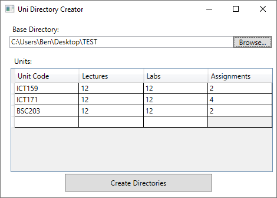

# Simple Directory Creator for University Units
## Screenshot

## Introduction
Specify the number of assignments, lectures, labs and the unit's code and have the appropriate folders generated automatically with the click of a button.

## Download
Download [HERE](https://github.com/RuggedRadius/simple-uni-directory-creator/blob/main/bin/Debug/UniDirectoryCreator.exe?raw=true)
